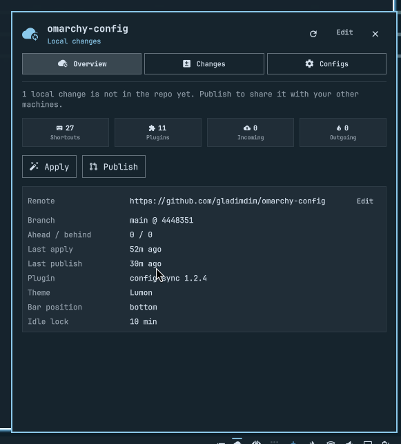
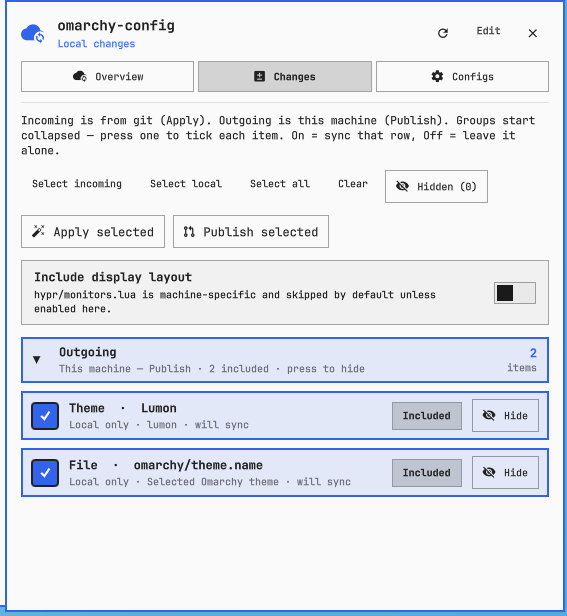
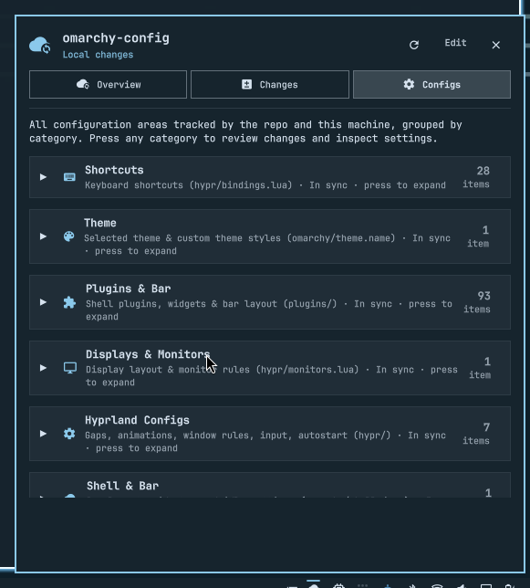

[](https://github.com/tcballard/omarchy-badges)

# Omarchy Config Sync (`gladimdim.config-sync`)

A status-bar plugin to seamlessly sync all your Omarchy configurations, shortcuts, themes, and plugins between your machines using a private Git repository.

<p align="center">
  
  &nbsp;
  
  &nbsp;
  
</p>

**New here?** Follow the [first-time setup guide](GETTING-STARTED.md): create an empty **private** GitHub repo, paste its URL into the tray icon, review this machine, then **Publish this machine**. Keep that repo private so shortcuts, hooks, and scripts are not public.

Click the cloud-sync tray icon, paste the git URL of your config repo, preview what would land on this machine, then **Apply**. When you add a shortcut or plugin locally, open the panel again and **Publish** to send it to the next machine.

When there is drift, **Review Changes** opens a checklist: incoming vs local **shortcuts** (individual keybindings), **plugins** (whole plugin), the **selected theme**, and other config files. Uncheck anything you do not want. Apply and Publish only touch the checked items. Applying a theme runs `omarchy theme set` on this machine.

## Features

- **Tray icon** in the Omarchy bar, with a badge when this machine and the repo have drifted.
- **Link a repo** by HTTPS, SSH, `owner/repo` shorthand, or a local git path (for example `~/Github/omarchy-config`).
- **Validates** that the clone is really an Omarchy config tree (`hypr/` plus `omarchy/shell.json`, `plugins/`, or `apply.sh`).
- **Preview before apply**: shortcuts from `hypr/bindings.lua`, plugins with versions, bar layout, hooks, helper scripts, and terminal configs.
- **Apply** copies repo → this machine (timestamped backup under `~/.config/omarchy-backup.<timestamp>/`), reloads Hyprland, and rescans the shell. The Config Sync widget itself is preserved in the bar even if the incoming `shell.json` does not list it.
- **Publish** copies this machine → repo, commits, and pushes so the next machine can Apply.
- **Drift detection** on open (and every 10 minutes): local-only edits, incoming remote files, both-changed files, and git merge conflicts.
- **Conflict handling**: per-file Keep local / Take repo for overlapping edits; Keep local / Take incoming for git merge conflicts. Display layout (`hypr/monitors.lua`) stays on this machine unless you opt in.

## Install

```bash
omarchy plugin add https://github.com/gladimdim/omarchy-config-sync-plugin --enable --yes
```

From a local checkout:

```bash
omarchy plugin add /home/$USER/Github/omarchy-config-sync-plugin --enable --yes
```

Place it next to the tray:

```bash
omarchy plugin enable gladimdim.config-sync --section right
```

## First machine vs next machine

| | First machine | Next machine |
| --- | --- | --- |
| GitHub repo | Create **empty + Private** (see [GETTING-STARTED.md](GETTING-STARTED.md)) | Same URL |
| After Connect | Tabs show **this machine** | Tabs show **the repo** |
| Primary button | **Publish this machine** (seed + push) | **Apply** (backup, then copy onto the machine) |

## Daily flow

1. **New machine** — click the icon, paste `https://github.com/<you>/omarchy-config.git` (or the local clone). Review Shortcuts / Plugins / Configs. Press **Apply**.
2. **You changed this machine** — open the panel. A badge and the Changes tab list local edits (new keybinding, plugin, …). Press **Publish** to commit and push.
3. **The other machine published** — a badge appears. Open the panel, review incoming files, press **Apply**.
4. **Both changed the same file** — Changes → Both changed → **Keep local** or **Take repo** per file, then Apply and/or Publish.
5. **Git diverged** (two machines pushed without pulling) — **Pull**, resolve any unmerged paths, then continue.

State lives in `~/.local/share/omarchy-config-sync/` so applying `shell.json` does not unlink the repo. Removing the plugin (`omarchy plugin remove gladimdim.config-sync`) forgets that state: a reinstall starts unlinked. **Unlink** in the panel does the same without deleting the plugin. A clone you pointed at in-place (for example `~/Github/omarchy-config`) is never deleted.

## What is synced

| Repo path | On this machine |
| --- | --- |
| `hypr/*.lua`, `hypr/*.conf` | `~/.config/hypr/` |
| `omarchy/shell.json` | `~/.config/omarchy/shell.json` |
| `omarchy/theme.name` | Selected theme (`omarchy theme set`); custom overlays under `omarchy/themes/<slug>/` (images skipped) |
| `omarchy/{branding,extensions,hooks,agents}/` | same under `~/.config/omarchy/` |
| `plugins.json` | Plugins installed with git (`omarchy plugin add`): id, version, commit, and source URL. Never copied as files; see below. |
| `plugins/*` | `~/.config/omarchy/plugins/` for plugins that are **not** git checkouts, file by file (skips this plugin; shebang/ELF helpers keep the execute bit) |
| `bin/*` | `~/.local/bin/` (scripts already in the repo, plus local helpers named by bindings, hooks, or plugins) |
| `terminals/alacritty.toml` etc. | matching terminal config files |

### Git-installed plugins

A plugin folder with a `.git` checkout is never copied in either direction, so Apply cannot downgrade it or leave `omarchy plugin update` refusing to fast-forward. Instead, Publish records it in `plugins.json` (credentials are stripped from the source URL), and on the other machine the Changes tab shows:

- **Install** when a listed plugin is missing. It opens Omarchy's own plugin installer (`omarchy plugin add <source>`) in a floating terminal, so you see Omarchy's warning and confirm there.
- **Update** when the repo lists a newer version or a commit this checkout has not seen. It opens `omarchy plugin update <id>`, which pulls the plugin's upstream, not the repo.
- An outgoing row when this machine is ahead, or when you uninstalled a listed plugin (unticked by default).

Repos that already hold copied files for a git plugin under `plugins/<id>/` stop applying them. Publishing that plugin's list entry removes the copy from the repo. Plugins without `.git` (your own, or a clone of a built-in) keep syncing file by file.

Machine-local files are **not** applied unless you enable **Include machine-local files**:

- `hypr/monitors.lua` (display layout)
- Extra paths listed in `.omarchy-config.json` under `machine_local`

Per-machine Hyprland overlays (`*.local.lua`, `local.conf`, `input.local.lua`, …) are ignored entirely so they never show up as Incoming. Plugin files such as `Local.qml` are still synced. Night-light (`hypr/hyprsunset.conf`) stays portable.

Shortcut cherry-pick copies one `o.bind` / `o.rebind` / `hl.unbind` line at a time. A command that is a string, a number, `os.getenv(...)`, or `hl.dsp.*` is portable. If the command only works because of a `local` defined elsewhere in `bindings.lua` (a helper function, an undefined name, …), that shortcut is listed with a skip reason and is **not** copied — applying it would abort Hyprland's `require("hypr.bindings")` on the other machine. Path locals such as `local snap = os.getenv("HOME") .. "/.local/bin/hypr-quarter-snap"` are inlined into a self-contained command when publishing. Helper scripts those bindings, hooks, or plugins reference are offered under **Helper scripts** (the rest of `~/.local/bin` is left alone). Apply restores the execute bit on plugin shebang scripts and ELF binaries (`radio-fetch`, `scripts/audio-*`, …) so Qt/QML `Process` can start them. Theme scripts still land non-executable.

## Keyboard

| Key | Action |
| --- | --- |
| Left click | Toggle panel |
| Right click | Refresh + fetch |
| `1`–`5` or `←` `→` | Switch tabs |
| `r` | Refresh |
| `c` | Review Changes (cherry-pick) |
| `a` | Apply selected |
| `p` | Publish selected |
| `Esc` | Close |

## Dependencies

Shipped on Omarchy: `python3`, `git`. SSH or a git credential helper is required to clone/push private GitHub repos. The helper never prompts for a password (that would freeze the bar); it fails with a message instead.

## Development

```bash
python3 -m unittest tests.test_config_sync -v
omarchy plugin validate .
```

Starter guide for end users: [GETTING-STARTED.md](GETTING-STARTED.md).

After tagging a new release, re-verify the marketplace listing for the exact new commit. See [AGENTS.md](AGENTS.md).

## License

MIT © 2026 Dmytro Gladkyi
